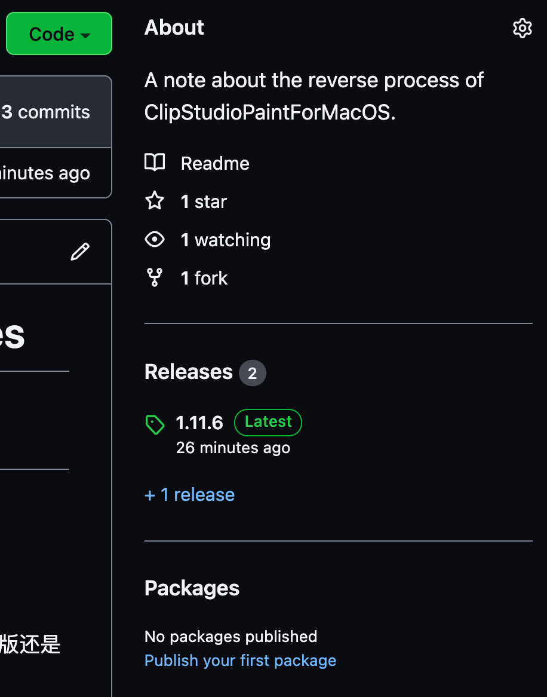
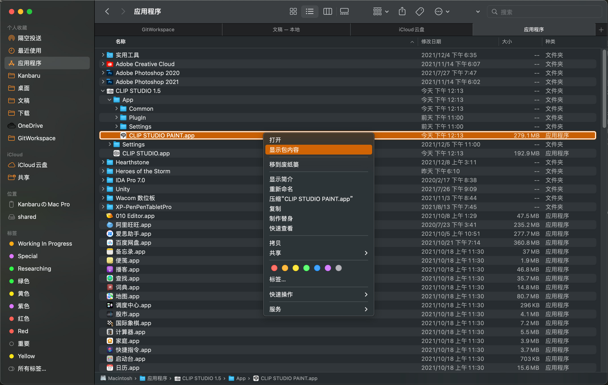
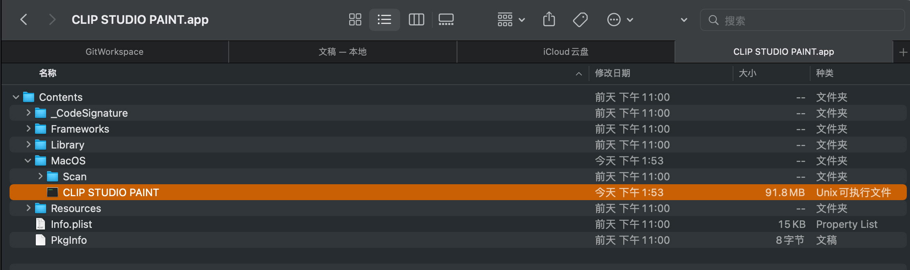

# ClipStudioPaintForMacOS-Reverse-Engineering-Notes
# 逆向Clip Studio Paint For MacOS 1.10.12笔记:
### 需要注意的点:
* 此版本CSP没有隐藏函数符号
* Planeswalker::Urza::URApplication::InitializeActivation()函数为应用启动时初始化激活信息的逻辑
* Planeswalker::Urza::URSelectGradeDialogBox::ExecuteDialog()函数负责显示应用程序启动时选择体验Ex版还是Pro版的界面
* Planeswalker::Venser::VEActivationEngine::FirstActivation(unsigned int)函数也是负责显示应用程序启动时选择体验Ex版还是Pro版的界面，但与上面的显示内容有些差异
* 此方法破解突破口在于未注册版本在执行某些操作时会弹出"未注册"的提示(例如档案->另存新档)，找到了与显示提示相关的方法为Planeswalker::Urza::URApplicationBehavior::GetStringIDMessageQuestionTrialVersion()，查找引用后，对每个引用逐个进行修改(笨方法)
* 处理完GetStringIDMessageQuestionTrialVersion调用后，又发现还有另外一个"未注册"的提示(例如编辑->自动上色)，相关方法为Planeswalker::Urza::URApplicationBehavior::GetStringIDMessageErrorTrialVersion()，与上一个处理方式类似，也是笨方法
* Planeswalker::Venser::VEActivationEngine::VerifyLicense() const也需要修改其返回值使其恒返回true
* 接下来绕过CSP启动时的选择体验版本的界面，整个软件大体上就可以正常使用了，还有一些不完美的地方就在版本资讯窗口处显示为Unregistered

## 如何使用??(萌新友好):
* 首先在当前页面右侧Releases下面找到最新版本点进去

* 下载Assets下面的CLIP.STUDIO.PAINT_x86_64.zip

* 解压缩CLIP STUDIO PAINT.zip后得到CLIP STUDIO PAINT文件
* 在访达中找到CLIP STUDIO PAINT.app右键显示包内容.(CLIP STUDIO PAINT.app一般路径在/Applications/CLIP STUDIO 1.5/App/CLIP STUDIO PAINT.app这里)

* 依次进入Contents -> MacOS, 然后将CLIP STUDIO PAINT替换为此仓库的修改版

* enjoy!

## 资源链接:
* 文中使用的CSP版本为1.10.12, 相关资源在Releases中
* 2021-12-14更新到1.11.6
* 2021-12-18更新到1.11.7
* 2021-12-29更新到1.11.8
* 2022-05-31更新到1.12.0

## 关于逆向工程源文件
* 我使用Hopper Disassembler来完成逆向分析
* 如果你想查看工程文件请访问[
CLIP STUDIO PAINT Mac 1.11.6.hop.zip](https://drive.google.com/file/d/169KdfDPt6q-9DiPn0TVhfUtCInGE2OCL/view?usp=sharing)
* 查看hop工程中的书签, 书签中包含一些关键的逆向信息(已添加注释)
